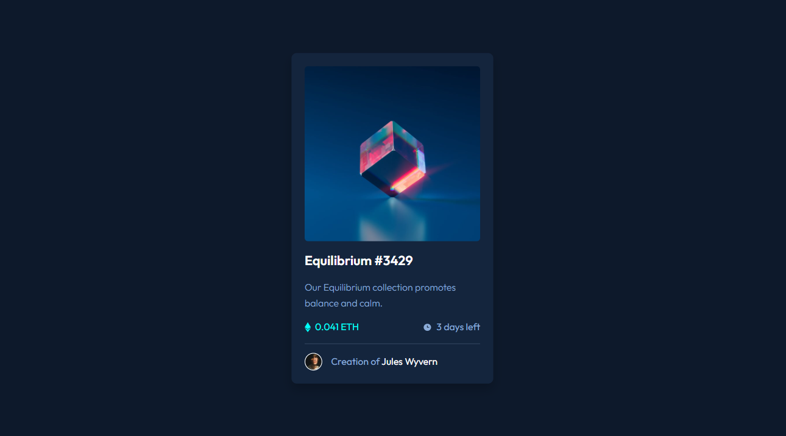

# Frontend Mentor - NFT preview card component solution

This is a solution to the [NFT preview card component challenge on Frontend Mentor](https://www.frontendmentor.io/challenges/nft-preview-card-component-SbdUL_w0U).

## Table of contents

- [Overview](#overview)
  - [Challenge](#challenge)
  - [Screenshot](#screenshot)
  - [Links](#links)
- [My process](#my-process)
  - [Built with](#built-with)
  - [What I learned](#what-i-learned)
  - [Continued development](#continued-development)
  - [Useful resources](#useful-resources)
- [Author](#author)

## Overview

### Challenge

Users should be able to:

- View the optimal layout depending on their device's screen size.
- See hover states for interactive elements.

### Screenshot



### Links

- Solution URL: [See the code on GitHub](https://github.com/KristinaRadosavljevic/NFT-preview-card-component)
- Live Site URL: [View live site](https://nft-preview-card-component-lake.vercel.app/)

## My process

### Built with

- Semantic HTML5 markup
- CSS/Sass
- Flexbox

### What I learned

This simple challenge was a perfect opportunity for me to practice Sass (a CSS preprocessor). I also paid more attention to using responsive units and flexbox layout.

One of the moments I'm definitely taking with me is the power of using `rem` units for responsive design. In this challenge, I employed a tip I heard in one of the online courses I attended, which is to lessen the root's `font-size` in media queries in order to automatically shrink all the text on the page:

```css
@media (max-width: 330px) {
  html {
    font-size: 12px;
  }
}
```

### Continued development

I definitely want to focus on practicing Sass and going more in depth in terms of code reusability and organization. Also, I'd like a get more familiar with animating transitions (which is something I tried in this project as well).

### Useful resources

One thing I had to research briefly is how to style `<hr>` elements, since nothing I tried on my own really worked. I found a useful resource and some very cool ideas on [this page](https://css-tricks.com/examples/hrs/).

## Author

- LinkedIn - [Kristina Radosavljevic](https://www.linkedin.com/in/radosavljevic-kristina/)
- GitHub - [KristinaRadosavljevic](https://github.com/KristinaRadosavljevic)
- Frontend Mentor - [@KristinaRadosavljevic](https://www.frontendmentor.io/profile/KristinaRadosavljevic)
